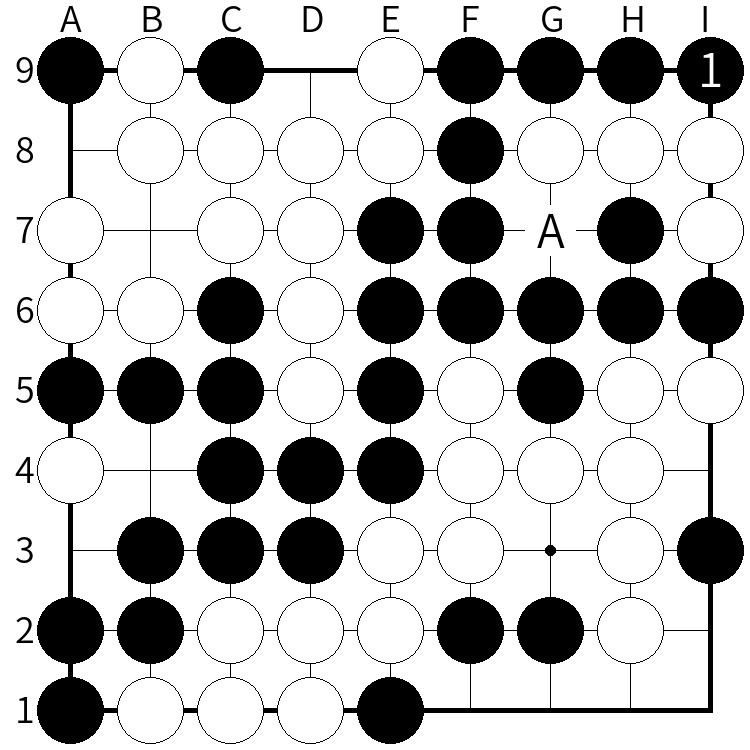

# 盤面生成プログラム for 九路地囲碁
九路地囲碁の特定盤面図を作成します。

特に囲碁クエストの棋譜を利用した問題の出題やその解説資料を作る際に有用です。

サイズは`750x750`ピクセル固定です。

# 必要環境
Python3

# 使い方
`python3 go.py <sgf input file>`

最後の`<sgf input file>`は適宜、自分のファイル名に置き換えてください。

## フォーマット
囲碁クエストの棋譜を元に、情報を付け加えます。

棋譜ファイルは例えば[ここ](http://c-loft.com/igo/quest/)から手に入ります。

サンプルとして`0001.sgf`ファイルをつけていますので、このファイルを基に説明します。

### 4行目まで
ダウンロード直後であれば、ここまで対局者の情報や棋譜情報が書かれています。

### 5行目
問題図として利用する手数を半角整数値で入力します。この数字までの手数が問題図として表示されます。

入力ファイル名に対し、先頭に`Q`が追加されます。この例では`Q0001.png`となります。

また最終手には石の上に小さなドットマークがつきます。

もしここで指定した数値が最終手よりも長い場合、最終手に自動変換されます。

### 6行目
生成する解説資料について、その分岐の数を半角整数値で指定します。例えば4つの分岐であれば、`4`と打ち込みます。

### 7行目以降
問題図の次の手以降の順を入力します。

`1[BA9]`など数字から始まる場合、指定した座標に指定した色で数字付きの石を置きます。括弧内は`[<石の色><座標>]`の順に記述します。

`A[G7]`など英字から始まる場合、指定した座標に英字を描き、石は表示しません。

ただし以下に述べる制約により、英字`S, T`は使えません。

記号は△と□のみ出力ができます。

`S[G8]`など四角の場合は`S`(quare)の後に座標を角括弧[]で記述します。同一行に複数記述することができます。

`T[E1]`など三角の場合は`T`(riangle)の後に座標を角括弧[]で記述します。同一行に複数記述することができます。

これら記号は共存が可能です。

出力ファイル名は先頭に`A`、最後に分岐の`_[1~]`の数字が自動で割り振られます。

例：`A0001_1.png, A0001_2.png`など。

# メリットとデメリット
## メリット
+ 棋譜ファイルを直接いじるだけで、一般の使用に耐えうるクオリティの図を作成できます。
+ コマンドと併用で、大量のファイルを一気に出力する際には非常に向いています。
+ 解説資料で石を置いた際に、自動で取り除く機能もついています。

## デメリット
+ コマンドベースなので、盤面把握には別のソフトが必要です。また手入力がやや面倒です。
+ メリットの３番目とは逆に、説明用としても取られる石をそのまま残すことはできません。番号付きの石を置いた時点で自動除去されます。
+ タイトルにもありますが九路地専用です。他のサイズが必要な際はご要望ください。

# ライセンス
MITライセンスに従います。

ただし付属のフォントファイル(源ノ角ゴシック)はApache License 2.0に従います。

# 今後
アイデア募集中。

# バグなど
Issueを立てるか、[Twitter(@ch_suginami)](https://twitter.com/ch_suginami)までご連絡ください。
